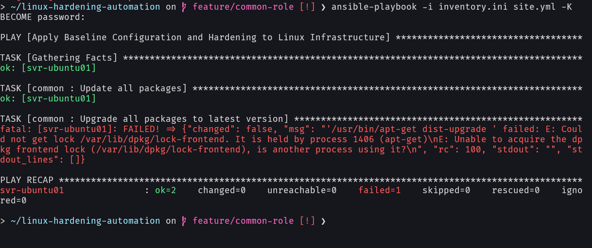
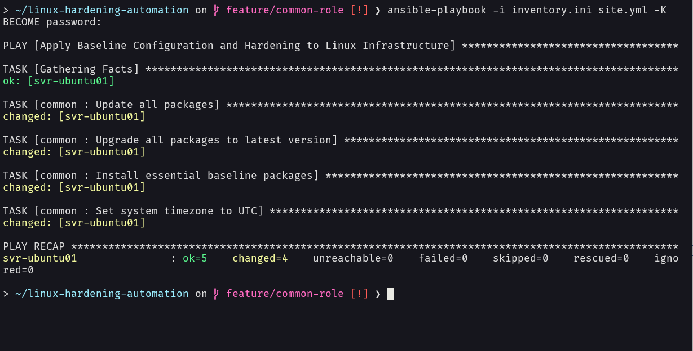
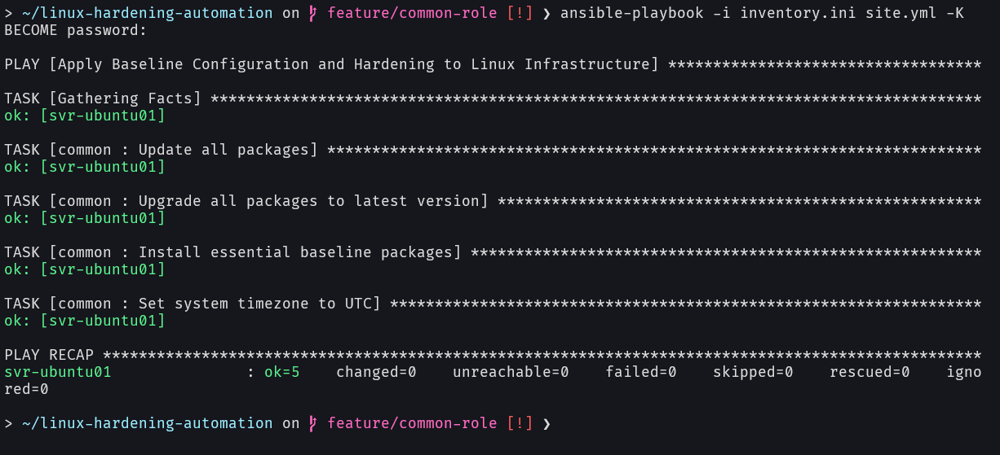

# Linux Hardening Automation

## Summary
This project provides production-grade, automated baseline configuration and security hardening for Ubuntu Server nodes using Ansible. By replacing manual host provisioning with modular, idempotent playbooks, this repository enforces security baselines, eliminates configuration drift, and minimizes human error across enterprise server deployments.

## Architecture & Topology
<!-- todo: -->
<!-- [Insert Architecture Diagram / Network Flow Chart] -->

- **Control Node:** WSL2 (Ubuntu / Ansible Core)
- **Target OS:** Ubuntu Server 24.04 LTS
- **Managed Node 1:** SVR-UBUNTU01
- **Managed Node 2:** SVR-UBUNTU02
- **Automation & Control:** Ansible, Bash, OpenSSH, Git
- **Security Control Layer:** UFW, SSH Key Authentication, Fail2ban

## Key Features & Automation

### Ansible Playbook

<!-- add purpose & control function as each role is implemented -->

| Role | Purpose & Control Function |
| :--- | :--- |
| **`common`** | Handles APT cache updates, background boot lock timeouts (`lock_timeout: 300`), non-interactive package upgrades, essential packages installation, and UTC clock synchronization. |
| **`storage`** | ... |
| **`users`** | ... |
| **`ssh`** | ... |
| **`firewall`** | ... |
| **`fail2ban`** | ... |

### Bash Scripts

<!-- todo: -->
<!-- add Bash scripts run on managed nodes -->

## Prerequisites & Setup 

### 1. Requirements
* Ansible 2.12+ installed on the control node.
* SSH access to target Ubuntu 24.04 server with `sudo` privileges.

### 2. Deployment Steps

```bash
# 1. Clone repo
git clone git@github.com:bycait27/linux-hardening-automation.git

# 2. Change into project directory
cd linux-hardening-automation

# 3. Update Ansible inventory with target host IP addresses
vim inventory.ini

# 4. Execute dry-run verification
ansible-playbook -i inventory.ini site.yml --check

# 5. Execute playbook 
ansible-playbook -i inventory.ini site.yml -K
```

## Verification & Execution Evidence

<!-- add verification & execution evidence as each role is implemented -->

### Role Common (Baseline Configuration)

**Failure Case — Unhandled APT Lock Collision**

*Initial execution failure caused by Ubuntu's background `unattended-upgrades` locking `/var/lib/dpkg/lock-frontend` upon fresh boot.*

**First Successful Execution (`changed > 0`)**

*Successful baseline installation after adding `lock_timeout: 300` and non-interactive environment flags*

**Second Execution — Idempotency Test (`changed = 0`)**

*Idempotency verification run. Zero changes applied on re-run, confirming steady-state configuration.*

## Key Learnings & Engineering Decisions

<!-- add key learnings & engineering decisions as each role is implemented -->

- **Ansible over Shell Scripting:** Selected Ansible over pure Bash scripts to achieve standard declarative state modeling, built-in dry-run (`--check`) verification, and native idempotency across multi-node target inventories.
- **Static IP over Dynamic IP:** Chosen to ensure the IP address stays static across consecutive executions of Ansible playbooks.
- **Boot-Time Lock Collision Mitigation:** Observed execution hangs when provisioning fresh VM snapshots due to Ubuntu's `apt-daily.service` holding `dpkg` lock files. Resolved by implementing `lock_timeout: 300` to allow background lock resolution without human intervention. 